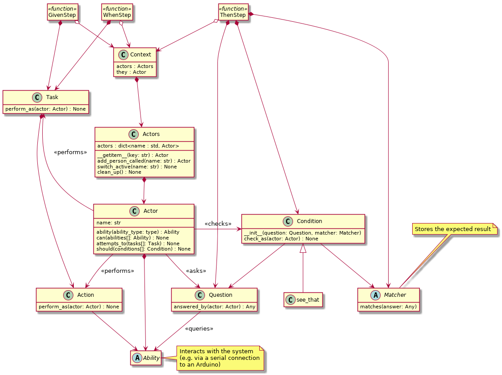

# Screen Play Pattern for Python



## Actor

``` python
from screenplay import Actor

actor = Actor.named('bob')
actor.can(interact_with_the_system())
```

**NOTE - This is not how an actor is normally created.
Normally you would use the `Actors.add_person_called(...)` method.**

## Ability

An ```Ability``` is a class you inherit from to give an ```Actor``` a way to
interact with the system under test.

``` python
from screenplay import Ability, Actor, Actors

class interact_with_the_system(Ability):
    def __init__(self):
        # Initialise object (optional)

    def clean_up(self):
        # Clean up, called when the Actor who
        # has the ability is no longer required

# ---

actors = Actors()
actors.add_person_called('bob').who_can(interact_with_the_system())
```

## Task

``` python
from screenplay import Task, Actor, log_message
from actions.click_on import click_on

class search_for_hello_world(Task):
    def __init__(self):
        # Initialise object (optional)

    @log_message('')
    def perform_as(self, actor: Actor):
        actor.perform_as(
            click_on()
            )
```

## Action

``` python
from screenplay import Action, Actor, log_message

class click_on(Action):
    def __init__(self):
        # Initialise object (optional)

    @log_message('click on ...')
    def perform_as(self, actor: Actor):
        # Do something using one of the actors Ability objects
```

## Question

``` python
from screenplay import Question, Actor

class value_read_from_the_system(Question):
    def answered_by(self, actor: Actor):
        # return a value read using one of the actors Ability objects
```

## Matcher

``` python
from screenplay import Matcher

class near_one(Matcher):
    def __init__(self):
        super().__init__()
        self._fail_message = 'Value was not near one'

    def matches(self, answer) -> bool:
        return 0.9 < answer < 1.1
```

## Condition

You generally only alias the ```Condition``` class you don't inherit from it.
(e.g. ```see_that``` is an alias of ```Condition```.)

A ```Condition``` constructor takes two parameters:

* ```question``` - an ```Question``` object that inspects the state of the
  system under test and returns
* ```expected``` - a ```Matcher``` object to check the result of the question

``` python
from screenplay import see_that, Actor, equals
from questions import value_read_from_system

bob = Actor.named('bob')

bob.should(
    see_that(value_read_from_system(), equals('20'))
    )
```

## Log

``` python
from screenplay.log import Log

# Only log messages from tasks
Log.to_tasks()

# Log messages from both tasks and actions
Log.to_actions()
```
